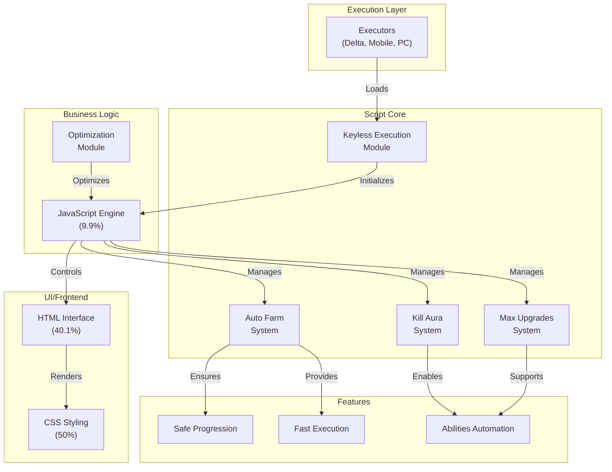

# Pixel Blade - Architecture Overview

## System Architecture

This document provides an overview of the Pixel Blade architecture for Roblox scripting and automation.

## Component Overview

### Execution Layer
- **Executors**: Compatible with Delta executor and mobile/PC executors
- Handles keyless execution for seamless script loading

### Script Core Modules

#### 1. **Kill Aura System**
   - Automated combat targeting and strikes
   - Safe operation without detection
   - Optimized for all executor types

#### 2. **Auto Farm System**
   - Automated resource and currency farming
   - Fast progression mechanics
   - Efficient task automation

#### 3. **Max Upgrades System**
   - Automatic character and ability upgrades
   - Progression optimization
   - Complete automation of upgrade chains

#### 4. **Keyless Execution**
   - Easy-to-use initialization
   - No key requirement for activation
   - Universal compatibility

### Frontend (UI)
- **HTML** (40.1%): Interface structure and layout
- **CSS** (50%): Styling, theming, and visual presentation

### Backend Logic
- **JavaScript** (9.9%): Core execution engine and feature management
- **Optimization Module**: Performance tuning and safe execution

## Key Features

✅ **Safe Progression** - Optimized to avoid detection  
✅ **Fast Execution** - Efficient script performance  
✅ **Complete Automation** - All abilities and upgrades automated  
✅ **Multi-Platform** - Works on Delta, mobile, and PC executors

## Workflow

1. User loads script via executor
2. Keyless execution initializes core modules
3. JavaScript engine manages feature logic
4. HTML/CSS provides user interface
5. Features execute simultaneously (Kill Aura, Auto Farm, Max Upgrades)
6. Optimization module ensures safe, fast operation

---

*Last Updated: 2026-01-29*